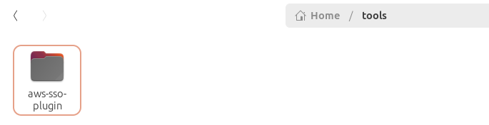
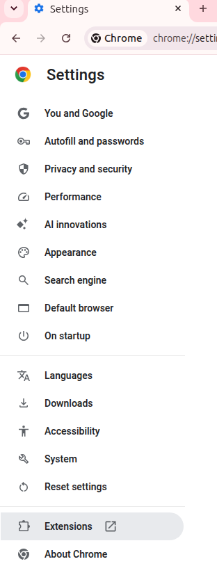
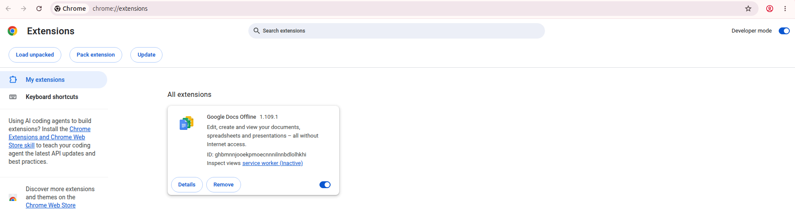
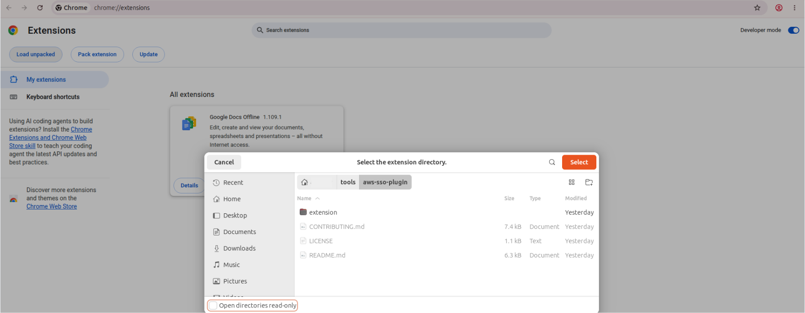
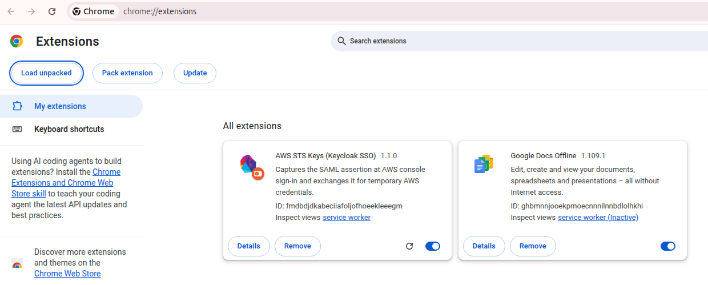
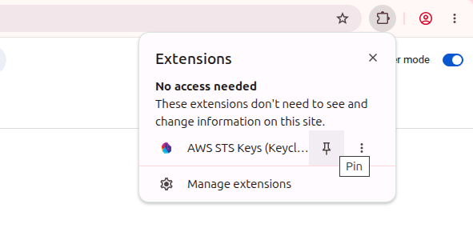
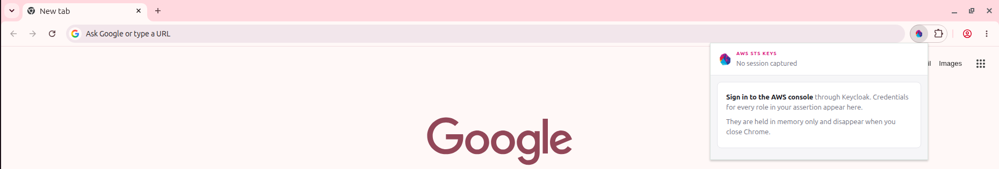

# AWS STS Keys (Keycloak SSO)

A Chrome/Edge extension that gives you AWS CLI credentials from the AWS console
sign-in you already do.

```
sign in to AWS console  →  pick an account  →  pick a role  →  copy  →  done
```

Credentials are issued only for the role you pick, nothing runs in the
background, nothing is written to disk, and everything disappears when you close
the browser.

---

## Before you start

- Google Chrome or Microsoft Edge, version **116 or newer**
- Your normal Keycloak access to the AWS console
- `git` installed (or use the ZIP download in Step 1)

---

## Step 1 — Get the files onto your machine

Clone the repo into a folder you will not delete or move — for example
`~/tools` on macOS/Linux, or `C:\Users\<you>\tools` on Windows:

```bash
git clone https://github.com/<your-org>/aws-sso-plugin.git ~/tools/aws-sso-plugin
```

No `git`? Click **Code → Download ZIP** on the repo page and unzip it into that
same kind of permanent folder.



**Why the folder matters.** Chrome loads the extension from this folder every
time it starts — it does not copy the files. If you move the folder to the
Desktop, delete it, or unzip it into `Downloads` and later clear `Downloads`,
the extension silently disappears.

## Step 2 — Load it into the browser

The browser needs the **`extension` folder inside the repo**, not the repo
folder itself:

```
~/tools/aws-sso-plugin/extension     ← select this one
```

That folder is the extension. Everything beside it in the repo is documentation
and automated checks, which the browser has no use for.

1. Open a new tab and go to `chrome://extensions`
   *(Edge: `edge://extensions`)*. You can also get there from the Chrome menu →
   **Settings** → **Extensions**.

   

2. Turn on **Developer mode** — the toggle in the top right

   

3. Click **Load unpacked** — button in the top left

4. Select `aws-sso-plugin/extension` and confirm

   

Check you picked the right one: the folder you select should have
`manifest.json` sitting directly inside it. If you see a `README.md` or a
`.github` folder instead, you selected one level too high.

A card titled **AWS STS Keys (Keycloak SSO)** appears. If you get an error
instead, jump to [Troubleshooting](#troubleshooting).



## Step 3 — Pin it to the toolbar

Click the puzzle-piece icon to the right of the address bar, find **AWS STS
Keys**, and click the pin next to it. The key icon now sits in your toolbar.



Clicking the pinned icon before you have signed in shows an empty popup — that
is expected:



## Step 4 — Use it

1. Sign in to the AWS console through Keycloak, exactly as you normally do
2. A number appears on the extension icon — that's how many roles you have
3. Click the icon

You'll see every account you have access to, listed and collapsed. There's a
filter box at the top if the list is long.

4. Click an account to see your roles in it
5. Click a role to get credentials for it

Only then are credentials issued — for that one role. You get a countdown to
expiry, the three values, and the copy buttons. The secret stays hidden until
you click **Show**.

Roles you've already used are marked **issued** and reopen instantly. Nothing is
requested for accounts you never click.

**If a role says the sign-in has expired:** sign in to the AWS console again.
Credentials can only be issued for a few minutes after a sign-in, and because
Keycloak already knows you, signing in again is just a redirect — no password.
Anything already issued keeps working.

**If you were already signed in to AWS before installing:** sign out and sign in
again. The extension can only catch a sign-in that happens while it's running.

---

## Using the credentials

### macOS / Linux

Click **Copy shell exports**, paste into your terminal, press Enter:

```bash
export AWS_ACCESS_KEY_ID=ASIA...
export AWS_SECRET_ACCESS_KEY=...
export AWS_SESSION_TOKEN=...
```

These apply to that terminal window only. Open a new tab, and you'll need to
paste again.

### Windows

Use **Copy profile block** instead — the shell exports are Bash syntax and
won't work in PowerShell or CMD. See the next section.

### Any platform — a named profile

Click **Copy profile block** and paste it into your AWS credentials file:

- macOS / Linux: `~/.aws/credentials`
- Windows: `C:\Users\<you>\.aws\credentials`

You get a block like:

```ini
[123456789012-PlatformAdmin]
aws_access_key_id = ASIA...
aws_secret_access_key = ...
aws_session_token = ...
```

Then use it from anywhere:

```bash
aws s3 ls --profile 123456789012-PlatformAdmin
```

Replace the old block when you refresh, rather than adding a second one with
the same name.

### Check it worked

```bash
aws sts get-caller-identity
```

You should see your own email address in the returned ARN.

---

## What to expect

- **Credentials last 4 hours.** When the countdown runs out, sign in to the AWS
  console again and get fresh ones. There is no automatic refresh — that's
  deliberate.
- **Only the roles you click get credentials.** Opening the popup and browsing
  accounts issues nothing. Nothing is requested from AWS until you pick a role.
- **They vanish when you quit the browser.** Nothing is written to disk by the
  extension. Reopening gives you an empty popup until you sign in again.

---

## Please don't

These credentials carry exactly the AWS permissions you already have. Treat
them like a password:

- Don't paste them into `.bashrc`, `.zshrc`, or any file that gets committed
- Don't put them in a Slack message, ticket, or shared doc
- Don't paste them into any website, including SAML or JWT decoder sites
- Don't share them with a colleague — they have their own access

---

## Keeping it up to date

```bash
git -C ~/tools/aws-sso-plugin pull
```

Then go to `chrome://extensions` and click the **reload** arrow on the
extension's card. Nothing else to do.

---

## Troubleshooting

| What you see | What's happening | What to do |
| --- | --- | --- |
| Popup says "No session captured" | You installed after signing in, or the sign-in didn't go through Keycloak | Sign out of AWS fully, sign in again |
| Extension gone after restarting the browser | The folder was moved or deleted | Restore the folder, repeat Step 2 |
| "Disable developer mode extensions" popup on startup | Normal for unpacked extensions | Click **Cancel** / **Keep**. Don't click Disable |
| **Load unpacked** button missing or greyed out | Browser policy blocks it on your machine | Contact the Internal DevOps team — you'll need a different install method |
| "Manifest file is missing or unreadable" | You selected the repo folder, not the extension folder | Repeat Step 2 and pick `aws-sso-plugin/extension` |
| A role shows an error instead of credentials | That role isn't configured yet, or its `MaxSessionDuration` is below the requested session length | Note the account and role name and report it |
| Every role says the sign-in has expired | More than a few minutes have passed since you signed in | Sign in to the AWS console again — it's a redirect, not a login |
| An account you expect isn't listed | It wasn't in your SAML assertion | Request access through the usual channel |
| `ExpiredToken` from the CLI | The session ran out | Sign in again, copy fresh credentials |
| `AccessDenied` from the CLI | Credentials are fine; the role lacks that permission | Normal — request access through the usual channel |
| Popup shows nothing after signing in | Something's broken | Report it to the Internal DevOps team |

---

## Uninstalling

`chrome://extensions` → find the card → **Remove**. Then delete the folder.
Nothing else is left behind — no files outside that folder, no stored data.
